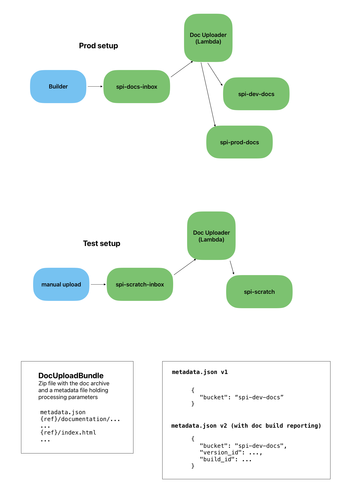

# spi-doc-uploader

SwiftPackageIndex helper package to upload and process documentation bundles.




## Dependencies for deployment

Install the following AWS tools to be able to deploy:

```
brew install awscli
brew tap aws/tap
brew install aws-sam-cli
```

Deployment also requires [Docker for Mac](https://docs.docker.com/desktop/install/mac-install/).

Run

```
aws configure
```

to set up the default credentials for deploying into AWS.

Subsequently, run either `make deploy-test` or `make deploy-prod` to deploy into the respective environment:

```
make deploy-test
```

## Lambda operation notes

https://docs.aws.amazon.com/lambda/latest/operatorguide/computing-power.html

## Release testing

There is currently no automated test setup to validate a new release, because it would be quite complex to set up.

Instead, use the `dev` environment to validate a new release as follows:

- Run the tests

    ```
    docker run --rm -v "$PWD":/host -w /host swift:5.9.0-amazonlinux2 swift test
    ```

- Deploy the new version to the "test" lambda

    ```
    make deploy-test
    ```

- Trigger a doc upload via the "test" lambda by uploading a doc bundle to `spi-scratch-inbox`:
  
  ```bash
    aws s3 cp dev-swiftpackageindex-semanticversion-0.3.6-356386b9.zip s3://spi-scratch-inbox/
    ```
  Use the doc bundle included in this repo or download a `dev-` doc bundle from `spi-docs-inbox` on S3.

- Check the [`DocUploaderLambda-Test` CloudWatch log group](https://us-east-2.console.aws.amazon.com/cloudwatch/home?region=us-east-2#logsV2:log-groups/log-group/$252Faws$252Flambda$252FDocUploaderLambda-Test-UploadFunction-3D3w0QTh1l6H) to confirm the new version has been triggered and processed the file without errors.

    ```bash
    open 'https://us-east-2.console.aws.amazon.com/cloudwatch/home?region=us-east-2#logsV2:log-groups/log-group/$252Faws$252Flambda$252FDocUploaderLambda-Test-UploadFunction-3D3w0QTh1l6H'
    ```

- Verify docs updated in [`spi-dev-docs`](https://s3.console.aws.amazon.com/s3/buckets/spi-dev-docs?region=us-east-2&prefix=swiftpackageindex/semanticversion/0.3.6/&showversions=false) for the given package (either by checking the timestamp or by deleting the version first and ensuring it re-appears).

    ```bash
    open 'https://s3.console.aws.amazon.com/s3/buckets/spi-dev-docs?region=us-east-2&prefix=swiftpackageindex/semanticversion/0.3.6/&showversions=false'
    ```

## Pushing a new release

Once a new release has been validated, push a new release as follows:

- Tag the version
- Run `make deploy-prod`

## Installing and updating SAM

Install:
```
brew tap aws/tap
brew install aws-sam-cli
```

Update:
```
brew upgrade aws-sam-cli
```